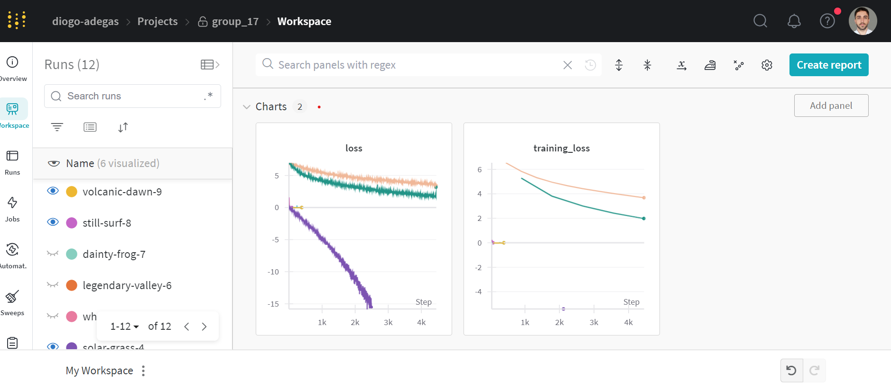
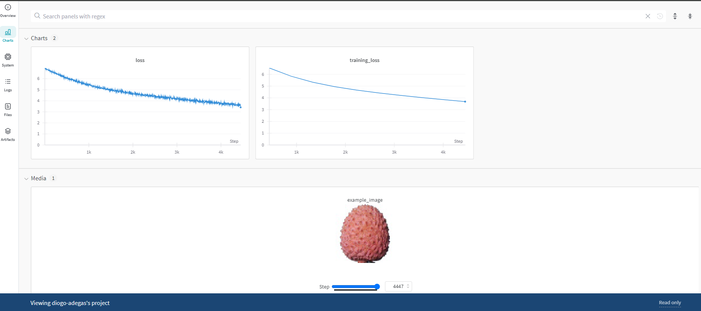
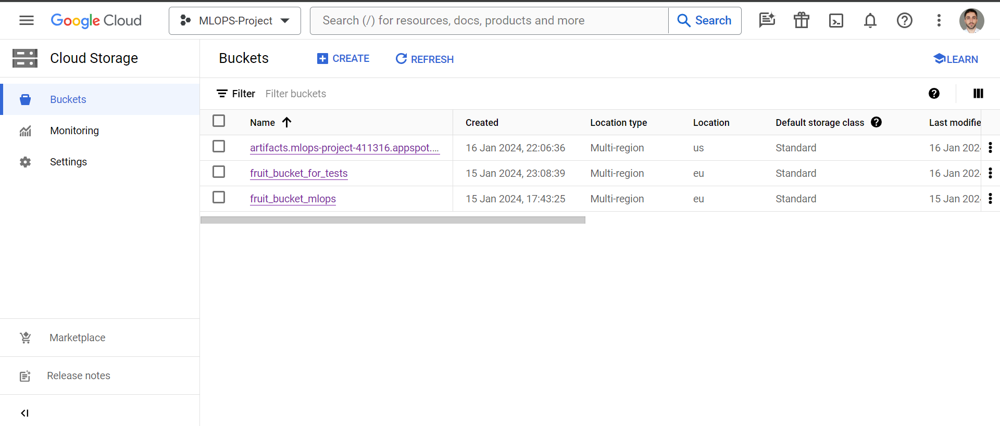
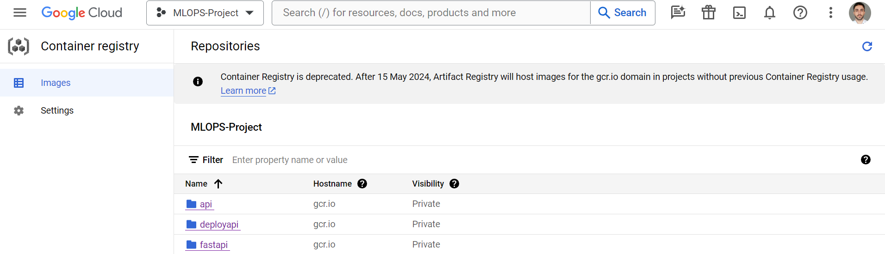
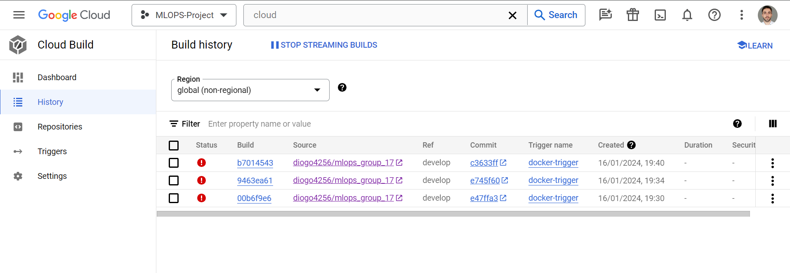
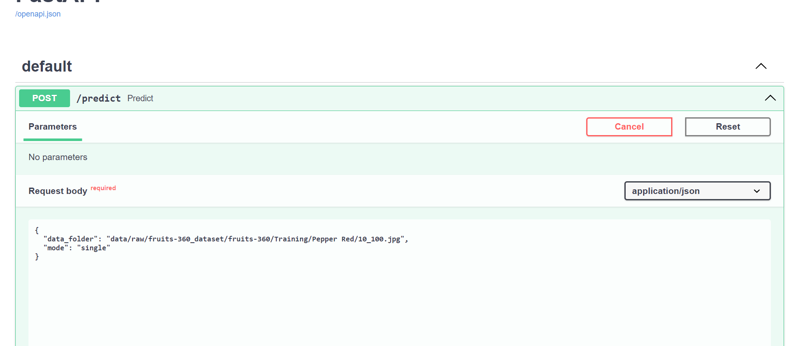
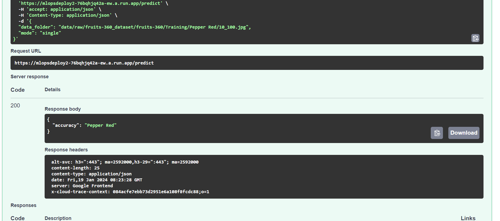
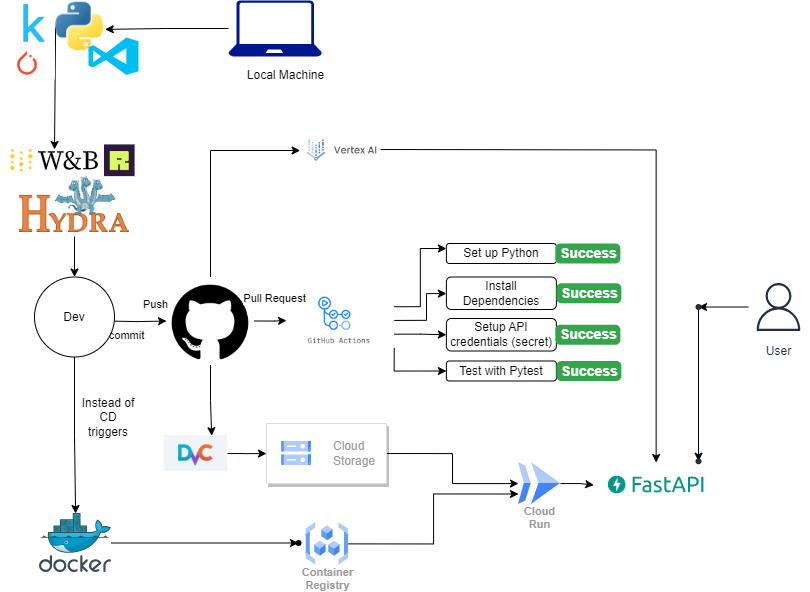

# Exam template for 02476 Machine Learning Operations

This is the report template for the exam. Please only remove the text formatted as with three dashes in front and behind
like:

``--- question 1 fill here ---``

where you instead should add your answers. Any other changes may have unwanted consequences when your report is auto
generated in the end of the course. For questions where you are asked to include images, start by adding the image to
the `figures` subfolder (please only use `.png`, `.jpg` or `.jpeg`) and then add the following code in your answer:

```markdown

```

In addition to this markdown file, we also provide the `report.py` script that provides two utility functions:

Running:

```bash
python report.py html
```

will generate an `.html` page of your report. After deadline for answering this template, we will autoscrape
everything in this `reports` folder and then use this utility to generate an `.html` page that will be your serve
as your final handin.

Running

```bash
python report.py check
```

will check your answers in this template against the constrains listed for each question e.g. is your answer too
short, too long, have you included an image when asked to.

For both functions to work it is important that you do not rename anything. The script have two dependencies that can
be installed with `pip install click markdown`.

## Overall project checklist

The checklist is *exhaustic* which means that it includes everything that you could possible do on the project in
relation the curricilum in this course. Therefore, we do not expect at all that you have checked of all boxes at the
end of the project.

### Week 1

* [X] Create a git repository
* [X] Make sure that all team members have write access to the github repository
* [X] Create a dedicated environment for you project to keep track of your packages
* [X] Create the initial file structure using cookiecutter
* [X] Fill out the `make_dataset.py` file such that it downloads whatever data you need and
* [X] Add a model file and a training script and get that running
* [X] Remember to fill out the `requirements.txt` file with whatever dependencies that you are using
* [X] Remember to comply with good coding practices (`pep8`) while doing the project
* [X] Do a bit of code typing and remember to document essential parts of your code
* [X] Setup version control for your data or part of your data
* [X] Construct one or multiple docker files for your code
* [X] Build the docker files locally and make sure they work as intended
* [X] Write one or multiple configurations files for your experiments
* [X] Used Hydra to load the configurations and manage your hyperparameters
* [X] When you have something that works somewhat, remember at some point to to some profiling and see if
  you can optimize your code
* [X] Use Weights & Biases to log training progress and other important metrics/artifacts in your code. Additionally,
  consider running a hyperparameter optimization sweep.
* [ ] Use Pytorch-lightning (if applicable) to reduce the amount of boilerplate in your code

### Week 2

* [X] Write unit tests related to the data part of your code
* [X] Write unit tests related to model construction and or model training
* [X] Calculate the coverage.
* [X] Get some continuous integration running on the github repository
* [X] Create a data storage in GCP Bucket for you data and preferable link this with your data version control setup
* [X] Create a trigger workflow for automatically building your docker images
* [X] Get your model training in GCP using either the Engine or Vertex AI
* [X] Create a FastAPI application that can do inference using your model
* [ ] If applicable, consider deploying the model locally using torchserve
* [X] Deploy your model in GCP using either Functions or Run as the backend

### Week 3

* [ ] Check how robust your model is towards data drifting
* [ ] Setup monitoring for the system telemetry of your deployed model
* [X] Setup monitoring for the performance of your deployed model
* [ ] If applicable, play around with distributed data loading
* [ ] If applicable, play around with distributed model training
* [ ] Play around with quantization, compilation and pruning for you trained models to increase inference speed

### Additional

* [ ] Revisit your initial project description. Did the project turn out as you wanted?
* [X] Make sure all group members have a understanding about all parts of the project
* [X] Uploaded all your code to github

## Group information

### Question 1

> **Enter the group number you signed up on <learn.inside.dtu.dk>**
>
> Answer:

17

### Question 2

> **Enter the study number for each member in the group**
>
> Example:
>
> *sXXXXXX, sXXXXXX, sXXXXXX*
>
> Answer:

s223531, s233349, s233537 , s182821

### Question 3

> **What framework did you choose to work with and did it help you complete the project?**
>
> Answer length: 100-200 words.
>
> Example:
> *We used the third-party framework ... in our project. We used functionality ... and functionality ... from the*
> *package to do ... and ... in our project*.
>
> Answer:

Our project is built within the PyTorch framework, and it has significantly facilitated the entire project lifecycle. Data preparation, model, training and predictions are built on top of the Pytorch library. The PyTorch ecosystem provided us a robust foundation, enabling us to efficiently implement our models. The models themselves are sourced from the PyTorch Image Models package, available at [PyTorch Image Models](https://github.com/huggingface/pytorch-image-models) specifically the ResNet-50 (untrained). This choice of framework not only streamlined the implementation process but also offered us extensive community support and a variaty of pre-built models. The flexibility and scalability of PyTorch have proven instrumental in meeting the project's objectives, showcasing the framework's effectiveness in tackling machine learning operations challenges.

## Coding environment

> In the following section we are interested in learning more about you local development environment.

### Question 4

> **Explain how you managed dependencies in your project? Explain the process a new team member would have to go**
> **through to get an exact copy of your environment.**
>
> Answer length: 100-200 words
>
> Example:
> *We used ... for managing our dependencies. The list of dependencies was auto-generated using ... . To get a*
> *complete copy of our development environment, one would have to run the following commands*
>
> Answer:

In our project, we managed our dependencies through a `requirements.txt` file. This is a simple text file that contains a list of all the packages that we use and was auto-generated using the package pipreqs which automatically scanned our project and created a requirements file specific to it. To ensure consistency across team members, the following steps are recommended for a new member to replicate the environment. Firstly, clone the repository, navigate to the project directory and verify that the `requirements.txt` file exists. Optionally, create and activate a virtual environment to isolate dependencies. Activate the environment and install the dependencies using `pip install -r requirements.txt`. This process guarantees that the new team member's environment mirrors the project's dependencies accurately.

### Question 5

> **We expect that you initialized your project using the cookiecutter template. Explain the overall structure of your**
> **code. Did you fill out every folder or only a subset?**
>
> Answer length: 100-200 words
>
> Example:
> *From the cookiecutter template we have filled out the ... , ... and ... folder. We have removed the ... folder*
> *because we did not use any ... in our project. We have added an ... folder that contains ... for running our*
> *experiments.*
> Answer:

From the cookiecutter template we have filled out all the folders except the docs folder, the notebooks folder and the visualizations folder inside the {{cookiecutter.project_name}} folder which in our case is called "src", so we chose the src-layout instead of the flat-layout. Furthermore there is a folder called "mlops_group17.egg-info" which is generated from the command $(PYTHON_INTERPRETER) -m pip install -e . in our Makefile. We also have another additional folder called "outputs" folder which is generated through hydra. Inside the src folder we have the models, predict_model.py, the config files and the make_dataset.py which imports our dataset inside the "data" folder. Lastly, inside the tests folder we have the unit tests related to the data part of our code and to model training.

### Question 6

> **Did you implement any rules for code quality and format? Additionally, explain with your own words why these**
> **concepts matters in larger projects.**
>
> Answer length: 50-100 words.
>
> Answer:

In our project, we implemented code quality and formatting rules using Ruff. These rules are crucial in larger projects for several reasons. Firstly, consistent code formatting enhances readability, making it easier for team members to understand and collaborate on the codebase. It ensures a uniform structure, reducing confusion and potential errors caused by inconsistent styling. Code quality rules, on the other hand, help identify potential issues early in the development process, ensuring that the code meets certain standards and is less likely to have errors.

## Version control

> In the following section we are interested in how version control was used in your project during development to
> corporate and increase the quality of your code.

### Question 7

> **How many tests did you implement and what are they testing in your code?**
>
> Answer length: 50-100 words.
>
> Example:
> *In total we have implemented X tests. Primarily we are testing ... and ... as these the most critical parts of our*
> *application but also ... .*
>
> Answer:

In total, we have implemented seven tests across the files inside the "tests" folder. In the test_data.py file, we have two tests: the test_images_to_tensor which checks if the length of the tensor list matches the number of image files and also checks if the shape of the first tensor in the list is correct and furthermore the test_retrieve_from_api which calls the `retrieve_from_api` function with mock objects. The test_training.py file includes multiple test cases for the training module including test_custom_dataset, test_load_data, test_setup_model_and_optimizer, test_train_one_epoch and test_train and each of them correspond to a function within the training and data preparation code.

### Question 8

> **What is the total code coverage (in percentage) of your code? If you code had an code coverage of 100% (or close**
> **to), would you still trust it to be error free? Explain you reasoning.**
>
> Answer length: 100-200 words.
>
> Example:
> *The total code coverage of code is X%, which includes all our source code. We are far from 100% coverage of our **
> *code and even if we were then...*
>
> Answer:

The total code coverage of our project stands at 65%, including all our source code but omitting the init files. While this percentage indicates a substantial coverage, the remaining 35% highlights potential untested paths that demand thorough exploration. The files that we covered concerned the train_model.py and make_dataset.py scritps. Achieving 100% code coverage is valuable, but it doesn't assure absolute error-free code. Complete coverage ensures that every line is executed under specific conditions, yet it may not cover all scenarios, edge cases, or intricate interactions between components. Furthermore, maintaining a balance between coverage and thoughtful testing strategies is essential for robust code quality.

### Question 9

> **Did you workflow include using branches and pull requests? If yes, explain how. If not, explain how branches and**
> **pull request can help improve version control.**
>
> Answer length: 100-200 words.
>
> Example:
> *We made use of both branches and PRs in our project. In our group, each member had an branch that they worked on in*
> *addition to the main branch. To merge code we ...*
>
> Answer:

Yes, our workflow involved branches and pull requests. Apart from the main branch and the develop branch, we utilized feature branches to manage different aspects of our development process. We made additional branches including unit_test (to include the unit tests), another for creating the Fast API, one for WandB, docker and one for setting up the cloud. To merge code in Github, we used the pull requests. Additionally, if the changes are developed in a separate feature branch, pull requests were used. Pull requests allowed for code review and discussion before the changes were merged into the target branch, ensuring a more controlled and collaborative approach to incorporating new code. When developing on our local branches we used git command like "git push" etc.

### Question 10

> **Did you use DVC for managing data in your project? If yes, then how did it improve your project to have version**
> **control of your data. If no, explain a case where it would be beneficial to have version control of your data.**
>
> Answer length: 100-200 words.
>
> Example:
> *We did make use of DVC in the following way: ... . In the end it helped us in ... for controlling ... part of our*
> *pipeline*
>
> Answer:

Yes, we employed DVC (Data Version Control) to manage data in our project. DVC helped us with uploading and managing changes of the data on the google cloud storage (at some point we needed to reduce our dataset size) and making sure each member of the group can get a current version of the data. Besides this, we faced a number of issues despite following the steps from the exercises. The primary benefit of it was that it offered a centralised way to access our data. DVC's support for remote storage further ensured that datasets were not only versioned locally but could also be shared and accessed by team members, resulting to a more organized and collaborative data management process in our project.

### Question 11

> **Discuss you continues integration setup. What kind of CI are you running (unittesting, linting, etc.)? Do you test**
> **multiple operating systems, python version etc. Do you make use of caching? Feel free to insert a link to one of**
> **your github actions workflow.**
>
> Answer length: 200-300 words.
>
> Example:
> *We have organized our CI into 3 separate files: one for doing ..., one for running ... testing and one for running*
> *... . In particular for our ..., we used ... .An example of a triggered workflow can be seen here: `<weblink>`*
>
> Answer:

Our continuous integration (CI) setup is structured into workflows to ensure comprehensive testing and maintain code quality. The first workflow focuses on unit testing. We ensure compatibility with Python 3.10.13, a version specified in the workflow. By defining specific versions, we aim to maintain consistency across different environments and prevent potential compatibility issues. To validate the integration of third-party services, such as Kaggle, we have a setup step for configuring Kaggle API credentials as "github secrets". We have implemented these secrets for our wandb integration on the unittests as well. Moreover, we used github's built-in standard runners for its execution. This allows our tests to interact with external services while maintaining the confidentiality of sensitive information. We run our code on all three different operating systems and we did not make use of caching. For a detailed example of our CI workflow, you can refer to this [here](https://github.com/diogo4256/mlops_group_17/actions/runs/7560474939). The tests.yalm file illustrates the steps taken in our CI process, including setting up Python, installing dependencies, and executing tests. In conclusion, we managed to set up the continuous integration pipeline (CI) into our project that would test any potential issues related to the individual functions in our training and data prep scripts.

## Running code and tracking experiments

> In the following section we are interested in learning more about the experimental setup for running your code and
> especially the reproducibility of your experiments.

### Question 12

> **How did you configure experiments? Did you make use of config files? Explain with coding examples of how you would**
> **run a experiment.**
>
> Answer length: 50-100 words.
>
> Example:
> *We used a simple argparser, that worked in the following way: python my_script.py --lr 1e-3 --batch_size 25*
>
> Answer:

We configured experiments using config files, maintaining flexibility and reproducibility. An example is our use of Hydra for configuration management. We used config files for all main scripts like training, make_dataset etc. We use it to pass on not only the hyperparameters but also the paths. The following is an example of a config file.

shuffle: True
batch_size: 64
learning_rate: 0.003
epochs: 10
weight_decay: 0.0005
dropout_rate: 0.5
processed_dataset: "data/processed/"
dataset_name: 'small_sample'

### Question 13

> **Reproducibility of experiments are important. Related to the last question, how did you secure that no information**
> **is lost when running experiments and that your experiments are reproducible?**
>
> Answer length: 100-200 words.
>
> Example:
> *We made use of config files. Whenever an experiment is run the following happens: ... . To reproduce an experiment*
> *one would have to do ...*
>
> Answer:

Whenever an experiment was executed in the output folder, a directory with the timestamp of our execution was created containing the log file from the experiment and regarding reproducibility a .hydra driectory that included the config files saved. This workflow allowed us to keep track of every experiment configuration and re-run it with the same hyperparameters as input to future runs. Once we believed that an experiment must be repeated with a particular set of hyperparameters, this approach of storing the config files proved to be efficient and with minimal loss of crucial information. However, to reduce the amount of files being pushed to the repository we decided to include the /outputs folder in the .gitignore file. For a small team like ours this approach enabled us to achieve reproducibility, even though not all experiments were pushed to the repository. We individually kept track of the most interesting configurations.

### Question 14

> **Upload 1 to 3 screenshots that show the experiments that you have done in W&B (or another experiment tracking**
> **service of your choice). This may include loss graphs, logged images, hyperparameter sweeps etc. You can take**
> **inspiration from [this figure](figures/wandb.png). Explain what metrics you are tracking and why they are**
> **important.**
>
> Answer length: 200-300 words + 1 to 3 screenshots.
>
> Example:
> *As seen in the first image when have tracked ... and ... which both inform us about ... in our experiments.*
> *As seen in the second image we are also tracking ... and ...*
>
> Answer:

As seen in the attached figures on our first image we have a number of experiments that were ran with different configurations on W&B, it can be seen that our first experiments (purple line) were wrongly ran with negative log likelihood (NLL), however we utilized cross-entropy loss afterwards and we received a decreasing loss as expected.


In our experiments we chose to track metrics like loss and training loss. They are crucial, since they provide insights into the performance and efficiency of the model being trained. The loss graph helps in understanding how well the model is learning from the training data over epochs or iterations. A decreasing loss value indicates that the model is learning and improving its performance, while an increasing or stagnant value may suggest issues with learning. Tracking these metrics allows for timely interventions to adjust hyperparameters or model architecture to achieve optimal performance. In the second W&B image a detailed overview of our most recent experiment/trained model is shown. Apart from the loss metrics one of the currently trained fruits is shown at the bottom.



In conclusion, keeping track of all experiments allowed us to fine-tune the model configuration, realise the error in our initial loss function implementation and after applying the correction we validated that the loss values followed the expected values (positive declining trend).

### Question 15

> **Docker is an important tool for creating containerized applications. Explain how you used docker in your**
> **experiments? Include how you would run your docker images and include a link to one of your docker files.**
>
> Answer length: 100-200 words.
>
> Example:
> *For our project we developed several images: one for training, inference and deployment. For example to run the*
> *training docker image: `docker run trainer:latest lr=1e-3 batch_size=64`. Link to docker file: `<weblink>`*
>
> Answer:

In our experiments, Docker played a pivotal role in creating containerized environments for consistent and reproducible execution. We crafted distinct Docker images tailored for training, inference, and deployment stages. To illustrate, running the training Docker image could be initiated with a command like:

docker run trainer:latest

Each Docker image encapsulates the necessary dependencies, libraries, and configurations, ensuring uniformity across various stages of the project. For an in-depth look at our Docker setup, you can refer to our [Dockerfile](../dockerfiles/train_model.dockerfile). This file delineates the steps involved in building the Docker image, showcasing how we encapsulated the environment to facilitate seamless and reproducible experimentation and deployment.

### Question 16

> **When running into bugs while trying to run your experiments, how did you perform debugging? Additionally, did you**
> **try to profile your code or do you think it is already perfect?**
>
> Answer length: 100-200 words.
>
> Example:
> *Debugging method was dependent on group member. Some just used ... and others used ... . We did a single profiling*
> *run of our main code at some point that showed ...*
>
> Answer:

The Debugging process varied among members,however since we all used VS Code as our preferred editor we utilized its built-in functionalities, e.g. the breakpoints and debugger. Moreover, we added a plethora of logs by using the logging library that kept track of our execution steps. When it comes to profiling, we attempted to do a single profiling run by using Pytorch Profiler and tensorboard to visualise the CPU performance (our laptops did not include GPUs). The backward convolution step was the most time-consuming, however we did not achieve any major optimisations and cProfile would help our code with optimising the runtime of the standalone functions we created.

## Working in the cloud

> In the following section we would like to know more about your experience when developing in the cloud.

### Question 17

> **List all the GCP services that you made use of in your project and shortly explain what each service does?**
>
> Answer length: 50-200 words.
>
> Example:
> *We used the following two services: Engine and Bucket. Engine is used for... and Bucket is used for...*
>
> Answer:

In our project, we harnessed the capabilities of several Google Cloud Platform (GCP) services, those were: Cloud Storage (Bucket), Compute Engine, Vertex AI, Cloud Build, Container Registry and Cloud Run. Google Cloud Storage (GCS) served as our robust object storage solution by using Buckets for managing large datasets efficiently. Vertex AI was used for the training of our model along with its built-in VM instance for computational resources. We set up triggers using Cloud Build services, however due to time limitations we could not integrate into our CI pipeline. For storing our docker images we used Container Registry. Cloud run was finally used to deploy our model which successfully integrated our FastAPI framework. This strategic use of GCP services empowered us to focus on developing and deploying machine learning models with enhanced scalability and automation.

### Question 18

> **The backbone of GCP is the Compute engine. Explained how you made use of this service and what type of VMs**
> **you used?**
>
> Answer length: 100-200 words.
>
> Example:
> *We used the compute engine to run our ... . We used instances with the following hardware: ... and we started the*
> *using a custom container: ...*
>
> Answer:

We have set up a VM instance using compute engine to test the capabilities of google cloud services. However, we didn't end up using the created instance once we found out the functionality of setting up individual VMs for training using Vertex AI. For the training jobs in Vertex AI we ended up using n1-highmem-2 machine type with a built-in container stored in the Container Registry. We have made effort to utilize the possibility of using GPU provided by Google Cloud services, however due to the errors we were facing and the time consuming nature of the debugging process we ended up limiting ourselves to CPU usage only.

### Question 19

> **Insert 1-2 images of your GCP bucket, such that we can see what data you have stored in it.**
> **You can take inspiration from [this figure](figures/bucket.png).**
>
> Answer:



### Question 20

> **Upload one image of your GCP container registry, such that we can see the different images that you have stored.**
> **You can take inspiration from [this figure](figures/registry.png).**
>
> Answer:



### Question 21

> **Upload one image of your GCP cloud build history, so we can see the history of the images that have been build in**
> **your project. You can take inspiration from [this figure](figures/build.png).**
>
> Answer:

As mentioned before we did not manage to get the triggers to work properly for the CI/CD.


### Question 22

> **Did you manage to deploy your model, either in locally or cloud? If not, describe why. If yes, describe how and**
> **preferably how you invoke your deployed service?**
>
> Answer length: 100-200 words.
>
> Example:
> *For deployment we wrapped our model into application using ... . We first tried locally serving the model, which*
> *worked. Afterwards we deployed it in the cloud, using ... . To invoke the service an user would call*
> *`curl -X POST -F "file=@file.json"<weburl>`*
>
> Answer:

We deployed our model solely on the cloud, using the aforementioned Cloud Run service. We wrapped our model into an application using the FastAPI framework. Due to time restrictions our deployed application currently can only access the data stored on our Google Cloud Storage Bucket and provide predictions to the client. Given more time we would utilise FastAPIs capability to include UploadFile in order to provide external images as our input and produce the respective image prediction. To invoke the service a user would have to access this link https://mlopsdeploy2-76bqhjq42a-ew.a.run.app\docs , provide the path to the data they want to predict and the mode arguement which differentiates between a batch of images or a single image and the returns the predicted label.




### Question 23

> **Did you manage to implement monitoring of your deployed model? If yes, explain how it works. If not, explain how**
> **monitoring would help the longevity of your application.**
>
> Answer length: 100-200 words.
>
> Example:
> *We did not manage to implement monitoring. We would like to have monitoring implemented such that over time we could*
> *measure ... and ... that would inform us about this ... behaviour of our application.*
>
> Answer:

We made use of Google Cloud's built-in monitoring systems and also set up SLOs to monitor the latency. However, we did not manage to set up a more advanced third-party monitoring or telemetry system. If advanced monitoring was implemented it would be vital for sustaining the longevity of our ML application. By tracking performance metrics, such as accuracy and data drift, to ensure model consistency over time. Detecting changes in resource utilization and addressing potential errors improves system scalability. Regular monitoring also allows for proactive issue resolution, preventing downtime and maintaining reliability. It aids in identifying anomalies, enhancing security, and meeting regulatory compliance. Integrating monitoring into our CI/CD pipelines ensures thorough evaluations before deployment, while user interactions provide insights for continual application improvement. Ultimately, monitoring would safeguard against unforeseen challenges and support the continual evolution of our fruit type prediction system.

### Question 24

> **How many credits did you end up using during the project and what service was most expensive?**
>
> Answer length: 25-100 words.
>
> Example:
> *Group member 1 used ..., Group member 2 used ..., in total ... credits was spend during development. The service*
> *costing the most was ... due to ...*
>
> Answer:

We managed to keep our expenditures low, despite having to train the model on the cloud multiple times using our datasets that were located on the bucket. The final cost of our project is $10.94. The service that costed the most was Cloud Storage at $4 due to the size of the data, while the second most costly service was Vertex AI at around $3.70 due to multiple long training runs.

## Overall discussion of project

> In the following section we would like you to think about the general structure of your project.

### Question 25

> **Include a figure that describes the overall architecture of your system and what services that you make use of.**
> **You can take inspiration from [this figure](figures/overview.png). Additionally in your own words, explain the**
> **overall steps in figure.**
>
> Answer length: 200-400 words
>
> Example:
>
> *The starting point of the diagram is our local setup, where we integrated ... and ... and ... into our code.
> *Whenever we commit code and puch to github, it auto triggers ... and ... . From there the diagram shows ...*
>
> Answer: 



Our system starts with an non-pretrained resnet model and a kaggle dataset consisting of images of fruits. We used conda to track our virtual environments, pytorch to train the model, and integrated git for version control, hydra for configurations/hyperparamethers and wandb logging into our code. We also added unit tests using the pytest framework, and docker for containerizing our system. We use cloud storage to store our dataset and our trained model, container registry for keeping docker containers, and vertex ai to run the user-queried predictions on a deployed Cloud Run instance of the previously created docker container using the FastAPI framework. Everytime we want to develop a feature independently from our colleagues, we create a branch. When we are comfortable with our changes and want to send them to the develop branch, we create a pull request that has to be approved by the other contributers. General pushing and pull requests trigger our unit tests, that are performed independently by a github actions runner. After the code is on develop and ready to deploy, we create a docker container and push it to google cloud's container registry. From there we create a cloud run instance that runs this docker container and gives it a domain, from which anyone can login and query it for a prediction. Upon every query, the input file goes through our trained model in the predict code in our deployed container, and returns the prediction if it's a single image, or an accuracy percentage in case of an image folder.

### Question 26

> **Discuss the overall struggles of the project. Where did you spend most time and what did you do to overcome these**
> **challenges?**
>
> Answer length: 200-400 words.
>
> Example:
> *The biggest challenges in the project was using ... tool to do ... . The reason for this was ...*
>
> Answer: 

The biggest challenges in our project were, in the initial stage, getting DVC to work in gdrive for everyone. We tried several approaches and fix attempts, but after the data was fully pushed (it took a long time to push it because it was a very big image dataset), there were cache related errors for the non-pushers that we weren't able to fix in due time. Despite having followed all guidelines and after asking in slack with no improvements, eventually we just moved on and used dvc with google bucket, because it was taking too much of our time (also because it took so much time to add and push each time) and we had exhausted all the different approaches we could think of - creating a fresh google cloud account, reinitializing the dvc repos, etc. Another big challenge was creating docker triggers for the continuous integration in GitHub Actions. We also spent a lot of time in this and eventually had to move on with other tasks. The trigger was actually triggering the build we wanted, so the theory was there, but then the build kept running indefinitely. We weren't able to debug it, so we had to scrap it and move on to pushing the docker container to gcloud without it being covered in the continuous integration part of our system.

### Question 27

> **State the individual contributions of each team member. This is required information from DTU, because we need to**
> **make sure all members contributed actively to the project**
>
> Answer length: 50-200 words.
>
> Example:
> *Student sXXXXXX was in charge of developing of setting up the initial cookie cutter project and developing of the*
> *docker containers for training our applications.*
> *Student sXXXXXX was in charge of training our models in the cloud and deploying them afterwards.*
> *All members contributed to code by...*
>
> Answer:

Student s233349 was in charge of setting up the initial cookie cutter project and developing of the code for importing our dataset from kaggle, wandb and logging, as well as our model from the Image Python Models.

Student s233537 focused on cloud infrastructure, specializing in training our models, docker, container triggers and deploying them efficiently. 

Student s223531 assisted with reducing the boilerplate code. and with managing unit tests as well as other essential checks through GitHub Actions. 

Student s182821 also assisted with unit testing, profiling, model deployment, the predict script as well as calculating the coverage percentage.

Overall, all members contributed to code through feature branches.
